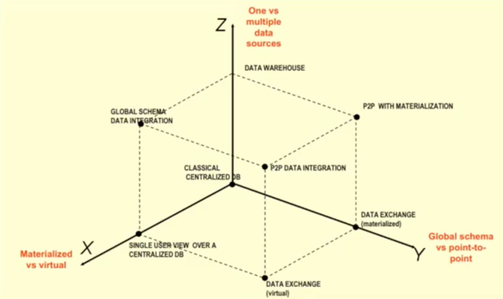

# Big Data Integration & Processing

## Information Integration

###### Overview
Refers to the problem of using many different information sources to accomplish a task.<br>

- **Integrated View** - A relation that is derived by querying two different data sources and combining their results. (A relation computed by other relations)
 
To populate the integrated view, we need to go through a step called **schema mapping**

- **Mapping** - Establish correspondence between the attributes of the view, (target relation) and that of the source relations.


- **Query architecture of the data integration system** - A method for evaluating a query to a data source that has been integrated. 
    - ```Z axis``` - specifies whether we have one data source or multiple data sources.
    - ```Y axis``` - Asks whether there is a single schema or a global schema defined.
    - ```X axis``` - Asks whether the integrated data is actually stored physically in some place or whether it is computed on the fly
        - If it is precomputed, we say that the data is **materialized**
        - If it's computed on the fly, we say it's **virtual**
        
    
        
-----


An obvious goal of an information integration system is to be complete and accurate
- complete - no eligible record from the source should be absent in the target relation
- accurate - all the entries in the integrated relation should be correct. 

<le>

- **Record Linkage problem** - Ensure that the set of data records that belong to a single entity are recognized, perhaps by 
clustering the values of different attributes, or by using a set of matching rules so that we know how to deal with it
during the integration process.
    - Schema mapping problem is a combinatorial challenge. 
    - **Pay-as-you-go-model** - Only integrate sources that are needed when needed. 
    - Paper - [Using Probabilistic Information in Data Integration](http://www.vldb.org/conf/1997/P216.PDF)
    
----

###### Integration for Multichannel Analytics

- **Customer Analytics** - Process and technologies that give organizations the customer insights necessary to deliver offers
that are anticipated, relevant and timely.
    - Is our product launch going well?
    - Is there an emerging product issue?
    - Where should the product team focus its development dollars?
    
- **Data Fusion** - Find the values of data items from a source. 

- **Source Selection**
    - The Problem
        - Choose only useful sources
        - Adding sources first improves integration accuracy then reduces it
    - The Solution
        - Order canidate sources based on the measure of "gooodness"
        - Add sources until the marginal benefit is less than the marginal cost
        - Current techniques scale well.
    
    
-----
###### Review
> 1. What is the main problem wih big data information integration? Many sources.
> 2. What would be the two possible solutions associated with "big data" information integration? Pay-as-you-go Model, Probabilistic Schema Mapping.
> 3. What are mediated schemas? A Schema created from integrating two or more schemas.
> 4. In attribute grouping, how would one evaluate if two attributes should go together? Similarity of Attributes, Probability of Two Attributes Co-occurring.
> 5. What is a data item? Data that represents an aspect of a real-world entity.
> 6. What is data fusion? Extracting the true data of a data item.
> 7. What is the potetnail problem of having too many data sources? Too many data values.
-----