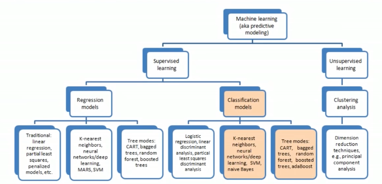

# Machine Learning


>Source: Deutsche Bank Quantitative Strategy 

## Association Rule Learning

- **Association Learning:** Discover interesting relations between variables in large datasets.
    - Trying to find association rules, insights from the data. 'strong rules'

###### How Mining Association Rules Work
``` 
Item     -> One attribute-value pair  (e.g attribute = purse, value = black)
Item Set -> All items occurring in a rule 
Accuracy -> Confidence. (Proportion of number of instances that the rule applies to 
```
    
When we create item sets, we want to specify a minimum coverage, or support. <br>

- Goals for Rule Generation
    - Produce only rules that exceed pre-defined support.
    - Find all item sets with the given minimum support. 
    - Generate rules from these item sets. 

-----

###### Review
> 1. Association rule learning is a method for discovering interesting relations, (strong rules) between variables in large databases.
> 2. Association rule mining is often called, **market basket analysis**
> 3. Mining association rules has a computation complexity problem. In order to prune rules the algorithm generates **frequent item sets**
> 4. In association rule learning, an item is considered to represent **attribute-value pair**
> 5. Support in terms of Association Rule generation refers to **occurring frequency of the rule**

-----


---

## Clustering Analysis

Basic idea of clustering, is grouping similar things together. This is a form of **unsupervised learning**.<br>

###### Why clustering?
- Interpret and label clusters.
- Identify important features.
- Characterize new points by the closest cluster (or nearest neighbors).
- Use the cluster assigments as a compression or summary of the data.

###### Difference ways of clustering results can be produced.
- Exclusive vs. overlapping
- Deterministic vs. probabilistic
- Hierarchical vs. flat
- Incremental vs. batch learning

###### Many different clustering techniques.
- K-means clustering
- Hierarchical clustering
- Conceptual clustering
- Probability-based clustering
- Bayesian clustering

###### Distance measurements
- Eucildean distance
    - ``` sqrt[ (a1 - b1)^2 + (a2 - b2)^2 + ... ]```
- Manhattan distance
    - ```[( |a1-b1| + |a2-b2| + ... )]```
- Mahalanobis distance
    - ```Euc Dist / ( sqrt[ (a1)^2 + (a2)^2 .. ] * sqrt[ (b1)^2 + (b2)^2 + .. ] )```

#### K-Means clustering

- Iterative distance based clustering method.
- Takes the data that we have and partition it into **k(disjoint)** clusters.
- Question, What is the _measure of similarity_?.

> Procedure 

1. Cluster centers are chosen at random.
2. Instsances are assigned to clusters based on their distance to the cluster centers.
3. Centroids of clusters are computed - "means".
4. Go to the 1st step until we converge.

```
Start with K Initial cluster centers
Loop:
  Assign each data point to the nearest cluster center
    Calculate mean of the cluster for the new cluster
  Stop when assignments don't change
```

How to chose K? How to choose initial centers? Will it always stop? What if we keep going?

K-Means Pros & Cons
- Simple and reasonably effective.
- The final cluster centers do not represent a global minimum but only a local one.
- Results can vary significantly based on initial choice of seeds.
- Algorithm can easily fail to find a reasonable clustering. 

-----
###### Review
> 1. Basic idea behind the clustering algorithm? Group similar things together.
> 2. In K-means, what does the K stand for? Number of clusters.
> 3. Clustering is, unsupervised type of learning.
> 4. K-means clustering results in what kind of clusters? Deterministic.
> 5. Clustering results can vary significantly based on initial choice of seed. 

-----


