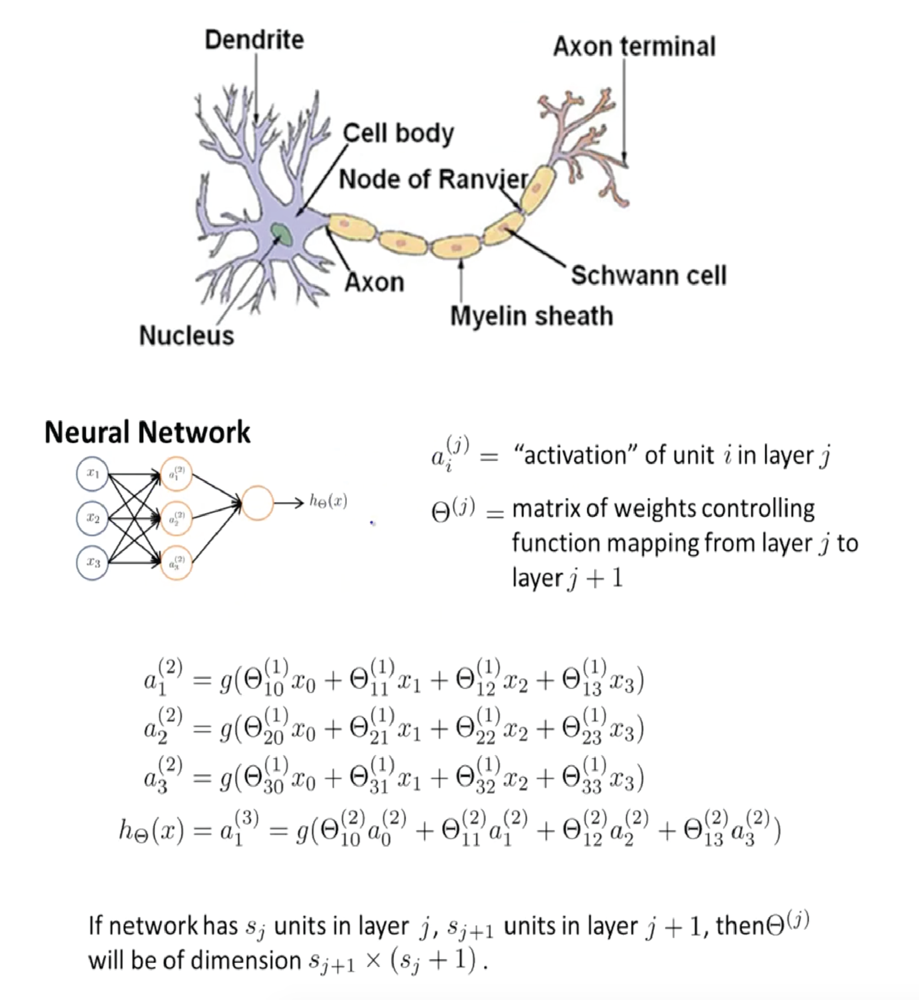

# Machine Learning #
### Neural Networks: Representation (Week 4) ###

> Welcome to week 4! This week, we are covering neural networks. Neural networks is a model inspired by how the brain works. It is widely used today in many applications: when your phone interprets and understand your voice commands, it is likely that a neural network is helping to understand your speech; when you cash a check, the machines that automatically read the digits also use neural networks.  

Neural Network Model Representation 
---

- **Non-linear hypotheses**
    - Trying to separate classes that end up lying in different regions of the space. (e.g computer vision)
    - When the dimension of the feature space is very large. (e.g 100x100 pixel images = > 50 million features)
    - Simple logistic regression is not a good way to learn complex nonlinear hypotheses when n is large.
    - **Neural Networks**, is a much better way to learn complex hypotheses and complex nonlinear hypotheses.

- **Neural Network** 
    - Origins: Algorithms that try to mimic the brain. Was very widely used in 80s and early 90s. Popularity diminished in the late 90s; Recent resurgence because large scale computing and processing.
    - Neural network is a group of different neurons connected together. 
    - Multiple layers for computation 
        - e.g [Layer 1: Input] --> [Layer 2: Hidden Layer] --> [Layer 3: Outputs] 
    - Utilize **Forward propagation** for a **Vectorized** implementation.
    - Similar to logistic regression, except that the input features are computational units derived from the hidden layer. (a1, a2, a3, ..)
    - In essence, neural networks learn on their own features to create a hypothesis. 
    - Neural network architecture: How the different neurons are connected to each other.
  
    
    
    